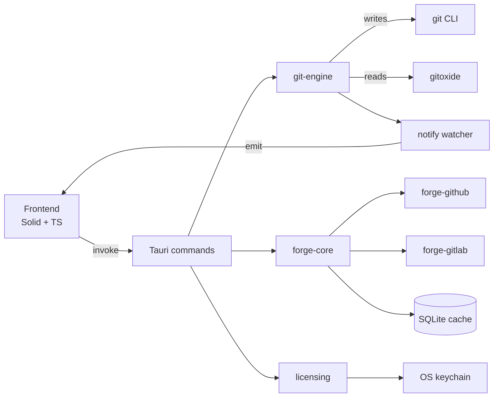
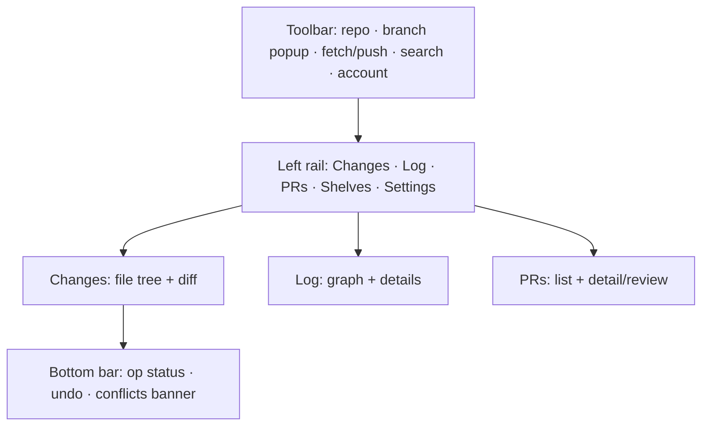
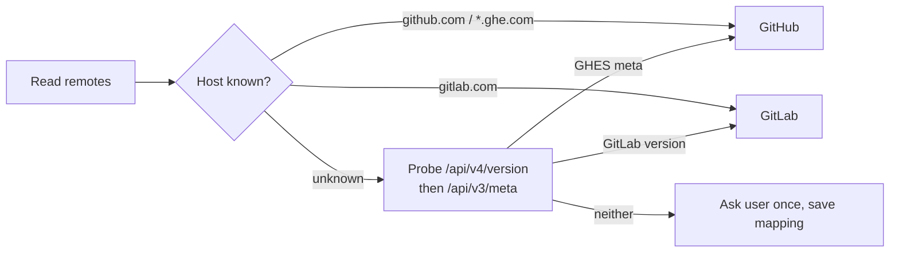
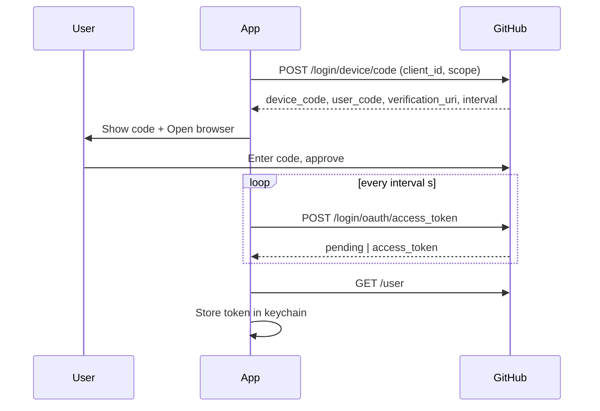
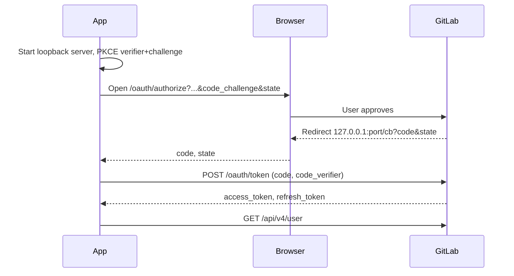
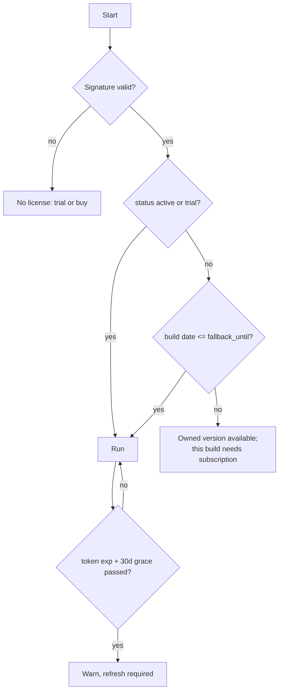
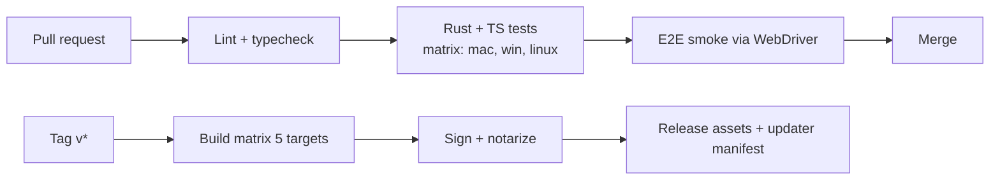
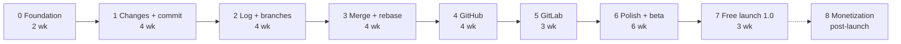

# Git Client — Spec, Flows & Implementation Plan

Exported from the living spec (rev 22) on 2026-09-22. Edit the spec and re-export; do not hand-edit this file.

## 1. Overview

A standalone Git client with IntelliJ-grade Git tooling, GitHub and GitLab built in, a small fast binary, and a subscription that converts to a perpetual license after 12 months. Working title: TBD (see Decisions log).

**Vision.** The Git experience of IntelliJ IDEA (line-level staging, changelists, log graph, three-pane merge, interactive rebase UI), free of the IDE, with first-class pull-request workflows for every major host.

**Product goals**

1. Best Git support: every daily Git operation done in the UI, with the safety and power users expect from IntelliJ.
2. Best UI/UX: fast, keyboard-driven, native-feeling on each OS.
3. Small and fast: under 25 MB download, under 1 s cold start, under 150 MB RAM on a mid-size repo, and fully usable on a low-end laptop (8 GB RAM, dual-core, HDD or slow SSD) with an IDE and browser already open.
4. Most platforms: macOS (Intel + Apple Silicon), Windows (x64 + ARM64), Linux (x64 + ARM64) from one codebase.
5. Sustainable business: launch free to earn adoption and word of mouth first; introduce paid plans (section 8) only after the product has proven itself.

**Success criteria for v1.0 (public launch)**

| Metric | Target |
| --- | --- |
| Cold start to usable Changes view (50k-file repo) | < 1.0 s |
| Status refresh after file save | < 300 ms |
| Log view scroll on 500k-commit repo | 60 fps, no jank |
| Line-level stage/unstage | < 100 ms round-trip |
| Active installs 90 days post-launch | ≥ 5,000, with ≥ 1,000 weekly active and ≥ 3,000 newsletter sign-ups |
| Crash-free sessions | ≥ 99.5 % |
| Idle RAM, one mid-size repo open for 10 min | < 120 MB total across all app processes |
| Reference low-end laptop (§4 Low-resource operation) | Every P0 flow completes within 2× the budgets above; no UI freeze > 100 ms |

**Out of scope for v1.0:** paid plans, licensing and billing (deferred; the plan is kept in section 8); Bitbucket, Azure DevOps, CodeCommit and Gitea providers (v1.x); mobile apps; a built-in code editor beyond diff/merge; team cloud features (shared changelists, review inbox sync).

## 2. Users & positioning

Primary user: a professional developer who knows Git well, misses IntelliJ's VCS tooling in VS Code, Zed, Neovim or Cursor, and reviews PRs daily.

**Personas**

| Persona | Pain today | What wins them |
| --- | --- | --- |
| Ex-IntelliJ dev now on VS Code | VS Code's Git panel and GitLens lack partial commits, changelists, a real log | Line-level staging, log graph, shelve |
| Team lead / reviewer | Web PR review is slow; context-switching between browser and editor | Local PR checkout, native diff review, one-click merge |
| Terminal Git user | Rebases and conflicts are error-prone in the shell | Interactive rebase UI, three-pane merge, safe undo |
| Polyglot on GitHub + GitLab | Every client favours one host | Identical PR/MR flow across hosts |

**Positioning vs alternatives**

| Product | Model | Strength | Gap we exploit |
| --- | --- | --- | --- |
| GitHub Desktop | Free, Electron | Simple, GitHub-native | Few power features, GitHub only, heavy |
| IntelliJ Git (git4idea) | Part of IDE | Best-in-class Git UX | Tied to a 1 GB IDE; weak GitLab; no standalone use |
| Fork | $49.99 one-time | Fast, polished | Small team, limited host integrations, no rebase UI depth |
| Sublime Merge | $99 one-time | Very fast, keyboard-driven | No hosting integrations, no changelists |
| GitKraken | Subscription | Rich integrations | Electron, heavy, busy UI |
| Tower | $69/yr | Polished, undo | No line-level staging on all platforms, no Linux |

**One-line pitch:** IntelliJ's Git, as a 20 MB app, with GitHub and GitLab pull requests built in, and a subscription you end up owning.

## 3. Requirements

Priority: P0 = must ship in v1.0, P1 = v1.x within 6 months of launch, P2 = later.

**Functional: local Git**

| ID | Requirement | Priority |
| --- | --- | --- |
| G1 | Open, clone, add, remove repositories; multi-repo sidebar | P0 |
| G2 | Changes view: unstaged/staged, per-file and per-hunk and per-line staging | P0 |
| G3 | Commit with message templates, amend, sign-off, GPG/SSH signing via user config | P0 |
| G4 | Push, pull, fetch, with upstream setup, force-with-lease, tags | P0 |
| G5 | Branch popup: create, checkout, rename, delete, compare, checkout-and-rebase | P0 |
| G6 | Log view: virtualized graph, filters (branch, author, path, text, date), details pane | P0 |
| G7 | Commit actions: cherry-pick, revert, reset (soft/mixed/hard), create branch/tag, copy hash | P0 |
| G8 | Three-pane merge conflict resolver with accept-left/right, auto-merge of non-conflicting chunks | P0 |
| G9 | Stash and Shelve (named, preview, partial unshelve) | P0 |
| G10 | Interactive rebase UI: reorder, squash, fixup, reword, drop, edit | P0 |
| G11 | Changelists: named groups of uncommitted changes, commit one at a time | P1 |
| G12 | Blame/annotate view with history for selection | P1 |
| G13 | Undo last operation (reflog-backed) for commit, rebase, reset, merge | P1 |
| G14 | Submodules, worktrees, LFS status | P1 |
| G15 | File history, compare any two revisions or branches | P1 |
| G16 | External change sync: reflect edits, commits, checkouts, rebases and stashes made by other editors, IDEs or the git CLI within 300 ms, without losing in-progress UI state | P0 |

**Functional: hosting integrations (GitHub, GitLab)**

| ID | Requirement | Priority |
| --- | --- | --- |
| H1 | Sign in: GitHub device flow; GitLab OAuth PKCE and personal access token; multiple accounts | P0 |
| H2 | Provider detection from remotes, incl. self-hosted GHES and GitLab | P0 |
| H3 | PR/MR list with filters, cached and offline-readable | P0 |
| H4 | PR detail: description, commits, checks, reviews, threads | P0 |
| H5 | Check out PR locally; native diff review; batch-submit comments and verdict | P0 |
| H6 | Create PR from branch with templates, reviewers, labels, draft | P0 |
| H7 | Merge with allowed strategies; delete branch; auto-switch to base | P0 |
| H8 | CI status per commit in Log and on PR header | P0 |
| H9 | Act as Git credential helper using the signed-in token | P0 |
| H10 | Issues: list, create, link branch | P1 |
| H11 | Notifications / to-dos inbox | P2 |

**Functional: licensing**

1.0 ships free for everyone with no sign-in, no trial and no license checks. The requirements below are retained for the monetization release and are all P2 until that decision is made.

| ID | Requirement | Priority |
| --- | --- | --- |
| L0 | 1.0 is free: no account, trial, license or feature gating anywhere in the app; only a version and build-date stamp in About so later plans can honour it | P0 |
| L1 | 30-day trial, no card, same token format as paid | P2 (deferred) |
| L2 | Monthly $5.99, Annual $49, Team $79/seat/yr; fallback license rule (section 8) | P2 (deferred) |
| L3 | Offline verification with Ed25519 signed tokens; 14-day token TTL + 30-day offline grace | P2 (deferred) |
| L4 | Machine activation (3 per individual license), deactivation from account page | P2 (deferred) |
| L5 | Team admin: seat assignment, invoice payment, VAT ID | P2 (deferred) |
| L6 | Free licenses for students and OSS maintainers via manual grant | P2 (deferred) |

**Non-functional**

| ID | Requirement |
| --- | --- |
| N1 | Performance targets in section 1 met on Linux kernel and Chromium repos |
| N2 | Never lose user work: every destructive op is reflog-recoverable or confirmed |
| N3 | Respect user Git config, hooks, credential helpers, signing, LFS, .gitattributes |
| N4 | Works fully offline for local Git; remote panels degrade to cached data |
| N5 | Accessibility: full keyboard navigation, screen-reader labels, respects OS reduced-motion and high-contrast |
| N6 | i18n-ready from day one (string tables); ship English only in v1.0 |
| N7 | Telemetry opt-in only; crash reports anonymized; no source code leaves the machine |
| N8 | Signed and notarized builds; auto-update with signed manifests |
| N9 | Low-resource operation: meets the budgets in §4 Low-resource operation on the reference low-end laptop; degrades gracefully (adaptive concurrency, lazy loading, bounded caches) instead of freezing or swapping |

## 4. Architecture

Tauri 2 shell, a Rust core split into independent crates, and a TypeScript frontend that only talks to the core through typed commands and events.



Commands go down, events come up. The frontend never spawns git, touches the filesystem or calls hosting APIs.

**Crates (Cargo workspace)**

| Crate | Responsibility | Depends on |
| --- | --- | --- |
| `git-engine` | All local Git: status, diff, staging, commit, log, branches, rebase, merge, stash, shelve, changelists | gix, tokio, notify |
| `git-engine-cli` | Thin dev CLI over git-engine for tests and debugging | git-engine |
| `forge-core` | `Forge` trait, neutral models, `AuthStrategy` trait, cache layer, polling scheduler | rusqlite, reqwest |
| `forge-github` | GitHub REST + GraphQL client, device-flow auth | forge-core |
| `forge-gitlab` | GitLab REST client, PKCE auth, PAT auth | forge-core |
| `licensing` | Token schema, Ed25519 verify, run-rule, activation, refresh client | ed25519-dalek, keyring |
| `credential-helper` | Separate binary implementing `git credential` protocol | keyring |
| `app` (`src-tauri`) | Tauri commands, event bus, settings, updater, menus | all above |

**Frontend**

- Framework: SolidJS + TypeScript (small runtime, fine-grained reactivity). Vite build.
- Diff and merge editor: CodeMirror 6 with `@codemirror/merge`, custom gutter for stage checkboxes.
- Commit graph: `<canvas>` renderer with virtualized rows; lane-assignment algorithm in a worker.
- State: one store per domain (repo, changes, log, forge, license) hydrated from Tauri events.
- Styling: CSS custom properties, OS light/dark, per-platform tokens (font, density, radius).

**IPC contract**

- Every Tauri command has a typed request/response in `packages/ipc-types`, generated from Rust via `specta` + `tauri-specta` so TypeScript never drifts from Rust.
- Long operations (clone, fetch, rebase) return an operation id and stream `op-progress` / `op-done` / `op-error` events.
- Repo state changes emit a single coalesced `repo-changed { repo_id, kinds: [status|refs|index|head] }` event, debounced 150 ms.

**Process model**

- Git CLI invoked with `--no-optional-locks`, `-c core.quotepath=off`, machine-readable flags (`--porcelain=v2 -z`), `CREATE_NO_WINDOW` on Windows, login-shell env resolved once on macOS.
- `gix` used for read paths: log walk, blame, tree/blob reads, ref listing. Any `gix` failure falls back to the CLI transparently.
- One `RepoActor` per open repository (tokio task) serializes writes and owns the watcher; reads run concurrently.

**Data at rest**

| Data | Location |
| --- | --- |
| Settings, recent repos | `app_config_dir/settings.json` |
| Forge cache | `app_data_dir/forge/<host>/<owner>/<repo>.sqlite` |
| Changelists, shelves metadata | `.git/<app-name>/` inside each repo |
| Tokens, license | OS keychain |
| Logs | `app_log_dir/`, rotated, 7 days |

**Low-resource operation (N9)**

The app must stay pleasant on the machines many developers actually have: an 8 GB laptop with 2–4 cores, integrated graphics, a slow disk, and an IDE, browser and Docker already consuming most of the RAM. Everything below is a design constraint from Phase 0, not a Phase 6 optimisation.

| Reference machine | Spec | Used for |
| --- | --- | --- |
| Low-end | 8 GB RAM, 2 cores / 4 threads, SATA SSD or HDD, 1366×768, Windows 10 or Ubuntu | Hard budget: all P0 flows within 2× of headline budgets |
| Mid | 16 GB, 4–8 cores, NVMe | Headline budgets in §1 |
| Constrained VM | 4 GB RAM, 2 vCPU (CI runner with cgroup limits) | Automated regression gate |

Budgets on the low-end machine:

| Metric | Budget |
| --- | --- |
| Cold start to Changes view (10k-file repo) | < 2 s |
| Peak RSS, all processes, one mid-size repo | < 250 MB; < 400 MB on Linux kernel repo |
| Idle RSS after 10 min | < 120 MB |
| Idle CPU | 0 % (no polling timers when watcher is healthy; PR polling paused when window unfocused) |
| Main-thread stall | never > 100 ms; all Git work off the UI thread |
| Background threads | at most `available_parallelism() - 1`, minimum 1 |
| Disk | forge cache ≤ 50 MB per repo, logs ≤ 10 MB, shelves user-controlled |
| Battery | no wake-ups when idle; watcher-driven, not timer-driven |

Design rules:

1. **Lazy everything.** Open one view at a time; the Log walk, PR session and blame start only when their view is shown and are cancelled when hidden. No commit graph is computed for a repo nobody is looking at.
2. **Bounded memory.** Log rows are a fixed-size LRU window (default 20k rows) with pages re-fetched from `gix`, never the whole history. Diffs over 5 MB or 50k lines load hunk-by-hunk. Blob contents are streamed, not held.
3. **Adaptive concurrency.** A single `tokio` runtime sized from `available_parallelism()`; concurrent `git` spawns capped (2 on low-end, 4 otherwise) with a priority queue so the visible view wins.
4. **Coalesce and cancel.** Watcher events are debounced; a new status request cancels the in-flight one; scroll-driven page fetches are cancelled when the viewport moves on.
5. **Cheap rendering.** Canvas graph draws only visible rows; no CSS filters, shadows or animations on scroll paths; `prefers-reduced-motion` honoured; images and avatars lazy and capped at 32 px.
6. **Multi-repo discipline.** Only the active repo has a live watcher and session; others poll HEAD every 60 s when the window is focused, never in background.
7. **Large-repo mode.** When a repo exceeds 100k files or 1M commits, prompt once to enable `core.fsmonitor`, `core.untrackedCache`, `feature.manyFiles` and commit-graph, and switch the Log to on-demand paging with a smaller window.
8. **WebView hygiene.** One WebView; no hidden iframes; DOM nodes in the Changes tree virtualised above 500 files; CodeMirror instances pooled and reused.
9. **Startup diet.** Nothing but settings, the active repo's status and the last view is loaded at launch; forge sessions, updater checks and telemetry start after first paint, at low priority.
10. **Measure on the constrained VM.** CI runs the P0 smoke flows inside a 4 GB / 2 vCPU cgroup with the synthetic large-repo fixture and fails on budget regressions > 10 %.

What this rules out: Electron (baseline 300+ MB), a JVM, per-repo background indexing, eager blame or graph computation, and any always-on polling.

## 5. Git engine spec

`git-engine` is a pure Rust library with no UI dependency: writes go through the `git` CLI, reads through `gix` with CLI fallback, and every public function is covered by fixture-repo tests on all three OSes.

**Git binary resolution**

1. User-configured path in settings.
2. `git` on PATH (login-shell PATH on macOS) if version ≥ 2.30.
3. Bundled MinGit (Windows) or bundled git (macOS, Linux AppImage) as fallback.
4. Never use Apple's `/usr/bin/git` stub if Xcode CLT is not installed.

**Core models (serde, shared with TS via specta)**

| Model | Key fields |
| --- | --- |
| `RepoInfo` | id, path, head (branch or detached sha), upstream, ahead/behind, state (clean, merging, rebasing, cherry-picking, reverting, bisecting) |
| `StatusEntry` | path, old\_path, index\_status, worktree\_status, is\_conflicted, is\_submodule, changelist\_id |
| `FileDiff` | path, hunks\[\], is\_binary, mode change, eol warning |
| `Hunk` | header, old\_start/len, new\_start/len, lines\[\] with kind (context/add/del), line ids |
| `Commit` | oid, parents\[\], author, committer, summary, body, refs\[\], signature status |
| `GraphRow` | commit, lane, parent\_lanes\[\], color index (computed for canvas) |
| `RebasePlan` | base, steps\[\] of {action, oid, message} |
| `ConflictFile` | path, ours blob, theirs blob, base blob, chunks\[\] with state |
| `Shelf` | id, name, created, patch path, files\[\] |
| `Changelist` | id, name, is\_default, paths\[\] with optional hunk selections |

**Command mapping**

| Operation | Implementation |
| --- | --- |
| Status | `git status --porcelain=v2 -z --branch --untracked-files=all` |
| Diff (worktree/index) | `git diff [--cached] --patch -z --no-color -U3 --no-ext-diff` |
| Stage file / unstage | `git add -- <p>` / `git restore --staged -- <p>` |
| Stage hunk or lines | Build minimal patch from selected line ids, `git apply --cached --unidiff-zero --recount` |
| Unstage hunk or lines | Same patch, `git apply --cached -R --unidiff-zero` |
| Discard lines | Reverse patch, `git apply -R` on worktree; snapshot to shelf first |
| Commit | `git commit -F <msgfile> [--amend] [--signoff]`; signing via user config only |
| Log | `gix` revwalk with topo order; fallback `git log --format=%H%x00%P%x00... -z` |
| Graph layout | Lane assignment on the Rust side, streamed in 500-row pages |
| Branch ops | `git switch`, `git branch -m/-d/-D`, `git checkout -b`, `git rebase <onto>` |
| Fetch/pull/push | `git fetch --prune`, \`git pull --rebase |
| Cherry-pick / revert | `git cherry-pick -x <oid>` / `git revert <oid>`; `--continue/--abort` surfaced |
| Reset | \`git reset --soft |
| Interactive rebase | Write todo file, run `git rebase -i <base>` with `GIT_SEQUENCE_EDITOR=<app> --seq-editor <todo>` and `GIT_EDITOR=<app> --msg-editor` |
| Merge conflicts | Read stages with `git show :1:p :2:p :3:p`; write result, `git add` to resolve |
| Stash | `git stash push -m -- [paths]`, `pop`, `drop`, `list -z` |
| Shelve | `git diff` (worktree+index) saved to `.git/<app>/shelves/<id>.patch`, then `git checkout -- paths`; unshelve = `git apply --3way` |
| Blame | `gix` blame; fallback `git blame --porcelain --incremental` |
| Undo | Record reflog position before each write; undo = `git reset --keep <prev>` or `git rebase --abort` per op type |

**Line-level staging algorithm**

1. Each diff line gets a stable id `(file, hunk_index, line_index)`.
2. Selection = set of ids of `+` and `-` lines the user ticked.
3. Build patch per hunk: unselected `+` lines are removed; unselected `-` lines become context; recompute hunk header counts.
4. Apply with `--cached --unidiff-zero` so context mismatches from partial selection do not fail.
5. Re-diff and re-render. Never trust the pre-apply line ids after this step.
6. Windows: preserve original EOL bytes in the patch; never normalize.

**Changelists (P1)**

- Metadata in `.git/<app>/changelists.json`: name, paths, per-file hunk selections.
- Committing a changelist: stash index, stage exactly its selection, commit, restore index.
- Files not in any list belong to the Default changelist. Moving files between lists is metadata only.

**Safety rules**

- Before any of: hard reset, discard, force push, rebase, checkout with dirty tree → record `SafetyPoint { reflog head, shelf id? }`.
- Undo menu shows the last 10 safety points with human labels.
- Force push only with `--force-with-lease`; plain `--force` behind an advanced setting.
- `index.lock` collisions: retry 5× with backoff 50→800 ms, then surface a clear message.

**External change sync (G16)**

The app is never the only writer: VS Code, IntelliJ, the git CLI, hooks and CI scripts all change the working tree and `.git`. The engine treats the repository on disk as the single source of truth and re-derives its state from it.

| Watched path | Signals | Reaction |
| --- | --- | --- |
| Working tree (recursive, honours `.gitignore`) | file saved, created, deleted, renamed | Re-run status for changed paths only; refresh open diff |
| `.git/index` | staging changed by CLI or another client | Full status refresh; reconcile staged view |
| `.git/HEAD`, `.git/refs/**`, `.git/packed-refs` | checkout, commit, branch create/delete, fetch | Refresh HEAD, branch list, ahead/behind, log incrementally |
| `.git/MERGE_HEAD`, `CHERRY_PICK_HEAD`, `REVERT_HEAD`, `rebase-merge/`, `rebase-apply/`, `BISECT_LOG` | operation started or finished outside the app | Switch repo state; show or clear conflict/rebase banner |
| `.git/refs/stash`, `.git/logs/**` | stash push/pop, reflog growth | Refresh stash list and undo history |
| `.git/config`, `.git/info/exclude`, `.gitattributes` | config edits | Reload config-dependent behaviour |
| `.git/index.lock`, `*.lock` | another process mid-write | Suppress refresh until lock disappears; retry policy |

Rules:

1. Coalesce events per repo in a 150 ms window (250 ms on Windows); process the union, not each event.
2. Ignore events caused by the app's own writes: tag each engine write with a generation number and drop watcher events that arrive before the post-write status snapshot completes.
3. Editors save atomically (write temp file, rename): treat create + rename pairs within the window as one modification.
4. If a file changed on disk while the user has ticked lines in its diff, re-map the selection by content; if a hunk no longer matches, drop only that hunk's selection and show a subtle notice.
5. Preserve UI state across refreshes: commit message draft, selected file, scroll position, expanded hunks, filter text.
6. Detect an external in-progress rebase or merge on open and offer Continue / Abort / Open merge tool.
7. Large repos: enable `core.fsmonitor` and `core.untrackedCache` when the user opts in; use the fsmonitor daemon's events as the primary signal where available.
8. Watcher fallback: if the OS watch limit is hit (inotify) or the watcher fails, poll `git status` every 2 s and show a warning with the fix.
9. Repo moved or deleted externally: mark it unavailable in the sidebar instead of crashing; offer Locate or Remove.
10. Test with a script that runs `git commit`, `git switch`, `git stash`, `git rebase -i` and editor saves against a repo the app has open; every state change must appear in the UI within the 300 ms budget.

**Testing**

- Fixture repos built by scripts under `tests/fixtures/` (CRLF files, long paths, unicode names, submodules, LFS pointers, 100k-commit synthetic history).
- Golden tests for patch construction: selection → expected patch bytes.
- Cross-OS CI matrix runs the whole suite; a test that passes on one OS only is a bug.

## 6. UI/UX spec

One window per repository set, three primary views (Changes, Log, Pull Requests) switched by a left rail, a persistent branch popup in the toolbar, and a command palette that reaches every action.

**Layout**



**Views**

| View | Contents | Key interactions |
| --- | --- | --- |
| Changes | Left: file tree grouped Staged / Unstaged / Untracked (or by changelist). Right: diff with per-hunk and per-line checkboxes. Bottom: commit message, amend, sign-off, Commit / Commit & Push | Tick a line to stage; Space toggles hunk; drag file between changelists; right-click → discard, shelve, ignore, history |
| Log | Canvas graph left, commit details right (message, files changed, checks badge). Filter bar: branch, author, path, text, date. | Right-click commit → cherry-pick, revert, reset, branch, tag, rebase from here, compare with working tree |
| Branch popup | Local, remote, recent; search; current highlighted with ahead/behind | Enter = checkout; ⌘/Ctrl+Enter = checkout-and-rebase; right-click → compare, rename, delete, push |
| Pull Requests | List (Mine, Review requested, All) with CI dots. Detail: description, commits, files with review diff, threads, checks. | Check out, comment on line, batch submit review, approve, merge |
| Merge tool | Three panes: ours · result · theirs, conflict chunks colored, ›‹ accept arrows, auto-resolved count | Accept left/right/both, edit result inline, Apply marks file resolved |
| Interactive rebase | Ordered list of commits with action dropdown; drag to reorder; preview of resulting history | Squash/fixup/reword/drop/edit; Start; conflict stops open Merge tool |
| Shelves | Named shelves with preview diff | Unshelve all / selected files; delete |
| Onboarding | Detect Git, sign in to hosts, add or clone repo | Under 60 s to first diff |

**Keyboard map (⌘ on macOS, Ctrl on Windows/Linux)**

| Shortcut | Action |
| --- | --- |
| ⌘K | Command palette |
| ⌘1 / ⌘2 / ⌘3 | Changes / Log / PRs |
| ⌘B | Branch popup |
| ⌘Enter | Commit (⌘⇧Enter: Commit & Push) |
| ⌘T / ⌘⇧P | Fetch / Push |
| ⌘Z | Undo last Git operation (when focus is not in a text field) |
| Space | Toggle stage on selected file/hunk/line |
| ⌘⇧S | Shelve selected |
| ⌘F | Filter in current view |
| J / K, ↑ / ↓ | Move between files or commits |

**Platform conventions**

- Native menu bar on macOS; hamburger-free toolbar on Windows/Linux with standard File/Edit/View menus.
- Fonts: system UI font per OS; monospace default SF Mono / Cascadia Mono / DejaVu Sans Mono, user-overridable.
- Density: compact by default, comfortable option. Hit targets ≥ 28 px.
- Follows OS light/dark and accent color; high-contrast theme included.
- Window state (size, splitters, last view) persisted per repo.

**Design principles**

1. Every action is reachable from keyboard, command palette and context menu.
2. No modal dialogs for routine work; conflicts and rebase stops appear as inline banners with actions.
3. Destructive actions show what will happen and offer undo afterwards instead of a confirmation wall.
4. Zero spinners over cached data; stale data is labeled, never hidden.
5. Copy IntelliJ's interaction model, not its visual style; the app should look like it belongs to the OS.

**Performance budgets (frontend)**

- Changes view renders 5,000 changed files without virtualization lag.
- Diff view handles 50,000-line files by windowing hunks.
- Log canvas draws 60 fps while scrolling 500k rows; data pages fetched ahead by 3 screens.
- Low-end laptop (§4): every budget above within 2×; no main-thread stall over 100 ms; idle CPU 0 %.
- Virtualise any list above 500 rows; pool CodeMirror instances; no animations on scroll paths.

## 7. Hosting integrations (GitHub, GitLab)

One `Forge` trait in `forge-core`, implemented per provider, with pluggable authentication and a cache-first data path so the PR view is instant and works offline.

**Provider detection**



Result: `RemoteIdentity { provider, host, owner, repo, remote_name }`, cached per remote URL.

**Forge trait (abridged)**

```rust
#[async_trait]
pub trait Forge: Send + Sync {
    fn capabilities(&self) -> Capabilities;
    async fn repo(&self, id: &RepoId) -> Result<RepoMeta>;
    async fn list_prs(&self, id: &RepoId, f: PrFilter) -> Result<Vec<PrSummary>>;
    async fn pr(&self, id: &RepoId, number: u64) -> Result<PrDetail>;
    async fn create_pr(&self, id: &RepoId, draft: NewPr) -> Result<PrSummary>;
    async fn review(&self, pr: &PrId, review: ReviewSubmission) -> Result<()>;
    async fn merge(&self, pr: &PrId, opts: MergeOptions) -> Result<MergeResult>;
    async fn checks(&self, id: &RepoId, sha: &str) -> Result<Vec<CheckRun>>;
    fn pr_fetch_refspec(&self, number: u64) -> String;
}
```

`Capabilities` flags: `draft_prs`, `squash`, `rebase_merge`, `approve`, `request_changes`, `issues`, `notifications`, `approval_rules`. The UI hides what a provider lacks.

**Authentication**

| Provider | Flow | Token lifetime | Storage key |
| --- | --- | --- | --- |
| GitHub / GHES | OAuth App device flow; scopes `repo read:org workflow notifications` | Non-expiring by default | `forge/github/<host>/<user_id>` |
| GitLab / self-managed | OAuth 2.0 PKCE, loopback redirect `http://127.0.0.1:<port>/cb`, scopes `api read_user` | 2 h access + refresh token | `forge/gitlab/<host>/<user_id>` |
| GitLab (fallback) | Personal access token pasted by user | Per token | same |





**Credentials: SSH, HTTPS, signing (all remotes)**

The app does not build its own credential store for Git. It plugs into the machinery developers already use — `ssh` and its agents, Git's credential-helper protocol, `gpg-agent` — and adds in-app prompts and a management screen, the way IntelliJ does. Rules:

1. Nothing is written to `~/.gitconfig`, `~/.ssh/config` or `known_hosts` by the app. Every hook is a per-process environment variable or `-c` flag on the `git` invocation.
2. Secrets live only in the OS keychain (`keyring` crate), one entry per host and identity, listed and deletable in Settings → Credentials.
3. If an agent or helper already answers, the app stays silent: zero configuration for the common case.
4. Prompts that Git or `ssh` would print to a terminal appear as native in-app dialogs instead.

| Case | Mechanism |
| --- | --- |
| SSH key in an agent (macOS keychain agent, `ssh-agent`, Windows OpenSSH agent, Pageant, 1Password or Bitwarden agent) | Detected via `SSH_AUTH_SOCK` or the Windows named pipe; used as is |
| SSH key with passphrase, not loaded | `SSH_ASKPASS` + `SSH_ASKPASS_REQUIRE=force` point at the app's helper binary; native dialog with "Remember in keychain"; on success `ssh-add` loads the key for the session |
| Unknown or changed host key | Helper shows host + fingerprint with Accept / Reject; `ssh` writes `known_hosts` itself; changed keys are never auto-accepted |
| No SSH key | Onboarding: Generate ed25519 key, Copy public key, and "Add to GitHub/GitLab account" via API when signed in; Test connection (`ssh -T`) |
| `core.sshCommand` / `GIT_SSH` set by user (e.g. `plink`) | Respected; the app injects `SSH_ASKPASS` only when no custom command is configured |
| HTTPS to a signed-in GitHub/GitLab host | `-c credential.helper=<app-helper>` per invocation supplies the OAuth token; no config include |
| HTTPS with the user's own helper (Git Credential Manager, `osxkeychain`, `libsecret`, custom) | Left in place and consulted by Git in its normal order |
| HTTPS with no answer | `GIT_ASKPASS` → in-app username/token dialog with "Remember in keychain" and a "Sign in with GitHub/GitLab instead" shortcut into OAuth; hosts that reject passwords never show a password field |
| Personal access tokens (self-managed GitLab, GHES) | First-class field in Accounts and in the HTTPS dialog |
| Two-factor auth | Satisfied by OAuth tokens; no password flows on GitHub/GitLab |
| Commit signing | `gpg.format`, `user.signingkey`, `commit.gpgsign` honoured; GPG prompts via `gpg-agent`'s pinentry, SSH signing via the agent; signing failures shown with the exact fix |
| Proxies, corporate CAs | `http.proxy`, `HTTPS_PROXY`, `http.sslCAInfo` passed through; TLS errors surfaced with a hint |
| Multiple identities | Per-host keychain entries; `~/.ssh/config` host aliases work because `ssh` reads them |

`credential-helper` binary: implements `get` / `store` / `erase`; on `get` returns the matching account's token as `password` and login as `username`; also serves as the `GIT_ASKPASS` and `SSH_ASKPASS` target, forwarding prompts to the running app over a local socket and falling back to a minimal native dialog if the app is not running.

Settings → Credentials lists stored HTTPS credentials and passphrases per host with Remove. Settings → SSH keys lists keys in `~/.ssh` with agent-loaded status, Generate, Copy public key, Add to agent, Add to account, Test connection. Platform detection warns when the Windows OpenSSH agent service is disabled or when no agent is running on Linux.

**Data path**

1. Session start: fetch repo meta, open PRs, checks for HEAD in parallel.
2. Write to SQLite; UI renders from SQLite immediately, then patches on arrival.
3. Refresh on: window focus, manual, after push from app, timer (PR list 90 s, HEAD checks 20 s while window focused).
4. GitHub: GraphQL for PR list (reviews, `statusCheckRollup`, labels, mergeable) in one query; ETag on REST.
5. GitLab: REST `merge_requests?state=opened`, then approvals + pipelines per opened MR.
6. Rate-limit headers respected; on 403 with reset time, back off and keep cached data.

**User flows**

| Flow | Local Git | API |
| --- | --- | --- |
| Create PR | Push with `-u` if no upstream | POST pulls / merge\_requests with template body, reviewers, labels, draft |
| Check out PR | `git fetch origin <refspec> && git switch pr-<n>` (GitHub `pull/<n>/head`, GitLab `merge-requests/<iid>/head`) | none |
| Review | Diff computed locally base..head; pending comments stored locally | GitHub: one `POST /pulls/<n>/reviews` with comments + event. GitLab: discussions per thread + approve |
| CI status | Badge per commit in Log | GitHub check runs + statuses; GitLab pipelines + jobs |
| Merge | After success: fetch, prompt to delete local branch, switch to base | GitHub `PUT /pulls/<n>/merge` (merge\_method); GitLab `PUT /merge_requests/<iid>/merge` (squash, remove source) |

**Line-position mapping for review comments**

- GitHub: `path`, `line`, `side` (`LEFT|RIGHT`), plus `start_line` for ranges.
- GitLab: `position { base_sha, start_sha, head_sha, old_path, new_path, old_line, new_line }`.
- Internal model stores both old and new line numbers so either can be produced.

**Error handling**

| Condition | Behaviour |
| --- | --- |
| 401 | GitLab: refresh token then retry once. GitHub: mark account needs re-auth, banner |
| 403 rate limited | Back off until reset; show cached data with stale badge |
| 422 on merge | Show API message verbatim (e.g. required checks failing) |
| Offline | All panels render cache; actions disabled with reason tooltip |
| Provider unknown | Read-only local Git; prompt to configure host |

## 8. Licensing & billing

**Status: deferred.** 1.0 launches free for all users (Decisions log, 2026-09-20). This section is the agreed plan for when paid plans are introduced, expected one or two quarters after launch once the app has meaningful adoption. Nothing in it is built for 1.0 except the version and build-date stamp that the fallback rule will later rely on. When the time comes, individual local Git use is expected to stay free; paid plans target team features, hosting-integration depth and priority support, and any change is announced at least 60 days ahead with existing users grandfathered where promised.

Subscription with a perpetual fallback: after 12 paid months the customer permanently owns the version current at that moment; updates continue only while subscribed. Verified offline with signed tokens; state lives in a small license server fed by merchant-of-record webhooks.

**Plans (USD, tax handled by MoR)**

| Plan | Price | Billing | Fallback vests | Activations |
| --- | --- | --- | --- | --- |
| Trial | $0 | 30 days, no card | never | 3 |
| Monthly | $5.99 | monthly | after 12 consecutive paid months | 3 |
| Annual | $49 | yearly | at end of first paid year | 3 |
| Team | $79 per seat | yearly, per seat, invoice allowed | per seat, after 12 months | 3 per seat |
| Free (students, OSS) | $0 | manual grant, 12 months renewable | never | 3 |

PPP regional discounts of 30–60 % on Individual plans via MoR country pricing. Monthly-to-annual switch carries the paid-months counter.

**Token schema (JSON, Ed25519-signed, base64url)**

```json
{
  "v": 1,
  "lic": "L-7f3a…",
  "plan": "monthly|annual|team|trial|free",
  "status": "active|past_due|cancelled|expired|trial",
  "sub": "user or seat id",
  "seats": 1,
  "paid_months": 7,
  "fallback_until": "2027-03-14",
  "features": ["forge", "changelists"],
  "machines": ["m-a1…"],
  "iat": "2026-09-20T10:00:00Z",
  "exp": "2026-10-04T10:00:00Z"
}
```

`fallback_until` = release date of the newest build the customer owns; null until vested; never decreases.

**Run rule (in the app, offline)**



The app refreshes the token in the background every 24 h while online; token TTL 14 days; offline grace 30 days beyond `exp`.

**License server**

- Small service (Rust, Axum) on a managed platform with daily backups. Endpoints: `POST /activate`, `POST /refresh`, `POST /deactivate`, `POST /webhooks/mor`, `GET /account` (via magic link), team admin CRUD.
- Webhook handling idempotent by MoR event id. Events: subscription created, renewed, payment failed, cancelled, refunded, seat quantity changed.
- State machine per subscription: `trial → active → past_due (7–14 d) → cancelled → expired`, with `paid_months` incremented on each successful renewal and `fallback_until` set when the vesting condition is met.
- Private key in an HSM or cloud KMS; public key baked into the app. Key rotation: tokens carry `kid`; app ships two public keys.
- Archive of every release kept downloadable forever to honour fallback.

**Merchant of record**

- Shortlist: Paddle (default) and Dodo Payments (India-friendly payouts). Decision pending onboarding trial (Decisions log).
- Products: Monthly, Annual, Team (quantity = seats), each with PPP pricing on Individual, VAT-ID collection, invoice payment for Team ≥ 5 seats.
- Refund policy: 14 days on first payment, no questions.

**In-app screens**

| Screen | Content |
| --- | --- |
| Trial banner | Days left, Buy, Sign in with license |
| Activate | Paste key or sign in by email magic link; shows plan, machines |
| Account | Plan, renewal date, paid months toward fallback, manage billing (MoR portal link), deactivate machines |
| Fallback notice | "Version X is yours to keep"; when unsubscribed and on newer build: download owned version or resubscribe |

**Pricing-page wording**

Subscribe for 12 months and the version you have at that point is yours to keep, forever, even if you cancel. Keep subscribing to get new features and updates. Security fixes to your owned version are free for one year.

**Test matrix (MoR sandbox)**

- Trial → buy monthly → 12 renewals → cancel → reinstall → owned build runs, newer build blocked.
- Monthly ×5 → switch to annual → counter carries.
- Payment failed → past\_due 14 d → recovery; and → expiry.
- Team: seat assign, reassign, reduce quantity below assigned.
- Offline 45 days: warning at 44, still runs on active token within grace rule.

## 9. Cross-platform, packaging & CI

One codebase, three OS targets, five architectures, all built, signed and published from a single GitHub Actions workflow on every tagged release.

**Targets**

| OS | Arch | Package | WebView |
| --- | --- | --- | --- |
| macOS 12+ | universal (x64 + arm64) | .dmg, notarized | WKWebView |
| Windows 10 1809+ / 11 | x64, arm64 | .msi (WiX) + .exe (NSIS), Azure Trusted Signing | WebView2 (evergreen bootstrapper) |
| Linux (glibc 2.31+) | x64, arm64 | AppImage, .deb, .rpm, Flatpak | WebKitGTK 4.1 |

**Platform rules**

| Concern | macOS | Windows | Linux |
| --- | --- | --- | --- |
| Git binary | Homebrew or bundled; skip Apple stub | Bundled MinGit fallback | System git; bundled in AppImage only |
| Process spawn | Login-shell env via `fix-path-env` | `CREATE_NO_WINDOW`; batch commands to cut spawn cost | default |
| Paths | Case-insensitive default FS | Backslash normalization, `core.longpaths=true`, 260-char guard | case-sensitive |
| EOL | as configured | Preserve bytes in patches; warn on mixed EOL | as configured |
| File watching | FSEvents via `notify` | ReadDirectoryChangesW, heavier debounce (250 ms) | inotify; raise watch limit hint |
| Credentials | osxkeychain, ssh-agent | Git Credential Manager, OpenSSH/Pageant | libsecret, ssh-agent |
| Keychain crate | `keyring` → Keychain | `keyring` → Credential Manager | `keyring` → Secret Service |
| Menus | Native menu bar, Cmd shortcuts | Standard menus, Ctrl | Standard menus, Ctrl |

**Signing & distribution**

- macOS: Apple Developer ID ($99/yr), hardened runtime, notarization via `notarytool` in CI.
- Windows: Azure Trusted Signing (cheapest trusted path); fallback EV certificate if unavailable in India.
- Linux: GPG-signed AppImage and repo metadata; Flathub submission post-1.0.
- Auto-update: Tauri updater plugin, signed `latest.json` manifest per channel (stable, beta), delta not required for v1.
- Release channels: `beta` weekly, `stable` on milestone. Version = semver; build date embedded for the fallback rule.

**CI pipeline (GitHub Actions)**



- Test matrix runs `git-engine` fixtures on all OSes; a platform-only failure blocks merge.
- Nightly job clones Linux kernel repo and runs performance benchmarks; regressions > 10 % fail.
- Dependency audit: `cargo audit`, `npm audit`, Dependabot weekly.

**Third-party licenses shipped**

| Component | License | Obligation |
| --- | --- | --- |
| Git (bundled) | GPLv2 | Include license text + source offer; separate process, no linking |
| gitoxide | MIT / Apache-2.0 | Notice |
| Tauri, CodeMirror, SolidJS | MIT / Apache-2.0 | Notice |
| MinGit | GPLv2 | as Git |

An About → Licenses screen lists all notices, generated by `cargo about` and `license-checker` at build time.

## 10. Implementation plan

Eight phases over roughly 8 months for a solo developer working with Claude Code, each ending in a runnable build with explicit exit criteria. 1.0 ships free; licensing work is removed from the plan and returns as a post-launch phase. Durations assume full-time effort; halve the scope, not the quality, if time is short.



**Phase 0: Foundation (2 weeks)**

- Cargo workspace + Tauri 2 app + Solid frontend scaffold; `specta` IPC types generation.
- Git binary resolution incl. bundled fallback; platform-aware process spawner.
- `RepoActor`, `notify` watcher, `repo-changed` event, settings store.
- CI matrix (3 OS) running an empty test suite; signing placeholders.
- Exit: app opens a repo and shows `git status` as a raw list on all 3 OSes; CI green.

**Phase 1: Changes & commit (4 weeks)**

- Status model, file tree (staged/unstaged/untracked), CodeMirror diff view.
- Stage/unstage file, hunk, line; discard with shelf snapshot; golden patch tests.
- Commit box with amend, sign-off, templates; push/pull/fetch with progress; credential errors surfaced.
- Command palette skeleton and keyboard map.
- Exit: daily-driveable for commit workflows; line-staging tests pass on CRLF fixtures; status refresh < 300 ms on 50k-file repo.

**Phase 2: Log & branches (4 weeks)**

- `gix` revwalk, lane layout, canvas renderer with virtualization; details pane.
- Filters (branch, author, path, text, date); commit actions: cherry-pick, revert, reset, branch, tag.
- Branch popup with compare and checkout-and-rebase; stash UI.
- Exit: 60 fps on 500k commits; all G5–G7 requirements; undo for reset and cherry-pick.

**Phase 3: Merge & interactive rebase (4 weeks)**

- Conflict detection, three-pane merge tool, accept left/right/both, auto-resolve count.
- Interactive rebase planner UI, sequence-editor helper mode of the binary, stop-and-resume flow.
- Shelve/unshelve with partial selection; undo for rebase and merge.
- Exit: resolve a 20-file conflict rebase end-to-end without a terminal; G8–G10 done.

**Phase 4: GitHub integration (4 weeks)**

- `forge-core` trait, SQLite cache, polling scheduler; provider detection.
- GitHub device-flow login, keychain storage, credential-helper binary.
- PR list, PR detail, check out PR, local review with batch submit, create PR, merge, CI badges in Log.
- Exit: full PR lifecycle on a test org incl. GHES-style custom host; works offline from cache.

**Phase 5: GitLab (3 weeks)**

- GitLab PKCE + PAT auth, `forge-gitlab` implementing the trait, MR flows, pipelines.
- Self-managed instance support with custom host mapping; capability flags exercised end to end.
- Version and build-date stamp in About and in the updater manifest (the only licensing-related work in 1.0).
- Exit: MR lifecycle on gitlab.com and a self-managed instance; parity checklist between GitHub and GitLab flows complete.

**Phase 6: Polish & private beta (6 weeks)**

- Changelists (G11), blame (G12), file history (G15), issues list (H10).
- Accessibility pass, high-contrast theme, reduced motion; onboarding flow.
- Performance work against Linux kernel + Chromium repos; memory profiling.
- Crash reporting (opt-in), auto-updater on beta channel, signed builds on all OSes.
- Private beta of 50–100 users; weekly builds; triage.
- Exit: crash-free ≥ 99.5 % across beta; success metrics in section 1 met.

**Phase 7: Free launch 1.0 (3 weeks)**

- Landing page with downloads for 3 OSes, feature tour with short videos, comparison pages vs GitHub Desktop, Fork, Sublime Merge and GitKraken; newsletter sign-up.
- Docs site, privacy policy, terms of use (free, no warranty), public issue tracker, Discord.
- Homebrew cask + winget manifest; Flathub submission started.
- Launch sequence: Hacker News Show HN, Product Hunt, r/git and r/programming, dev newsletters, a launch blog post on line-level staging.
- Exit: public downloads on 3 OSes, support inbox, status page and feedback loop live; launch-week metrics captured.

**Phase 8: Monetization (post-launch, when adoption is proven)**

- Trigger: ≥ 5,000 active installs and clear demand signals (team requests, self-hosted enterprise asks).
- Build section 8 as specified: licensing crate, license server, MoR products, account screens; announce 60 days ahead; keep individual local Git free.
- Exit: first paid Team subscriptions; no regression in free-user experience.

**Free launch and marketing plan**

| Channel | What | When |
| --- | --- | --- |
| Landing page + newsletter | Waitlist from Phase 1; email every phase milestone with a GIF of the new feature | Phase 1 onward |
| Build in public | Weekly short posts on X, Bluesky, LinkedIn and Mastodon showing progress; dev.to and Hashnode long-form monthly | Phase 1 onward |
| Private beta | 100–150 testers via waitlist, VS Code/Cursor communities, ex-IntelliJ users; Discord for feedback | Phase 6 |
| Show HN and Product Hunt | Launch day; founder answers every comment for 48 h | Phase 7 |
| Content | Comparison pages, "line-level staging explained", "interactive rebase without fear", GitLab MR review guide; YouTube demos under 3 min | Phase 7 onward |
| Community | r/git, r/programming, r/webdev, Lobsters, JetBrains and VS Code subreddits, GitLab forum | Phase 7 onward |
| Package managers | Homebrew, winget, Flathub, AUR listings drive discovery | Phase 7 |
| Partnerships | GitLab and Gitea community showcases; newsletter sponsorships (TLDR, Bytes, Console) once budget exists | Post-launch |
| Open-source lever | Consider open-sourcing `git-engine` or the credential helper under MIT to build trust and contributors while keeping the app proprietary | Decision in Phase 6 |

Metrics to watch weekly: downloads per OS, weekly active installs (opt-in telemetry), newsletter growth, GitHub issues opened and closed, Discord members, and the share of users connecting a GitHub or GitLab account.

**Post-1.0 roadmap (v1.x)**

| Quarter | Items |
| --- | --- |
| +1 | Monetization (Phase 8) if adoption trigger met; Bitbucket and Azure DevOps providers; notifications inbox; worktrees UI |
| +2 | AWS CodeCommit and Gitea/Forgejo; team admin portal; localization (de, ja, zh) |
| +3 | AI commit-message drafts (opt-in, local or API); PR description drafting; conflict-resolution suggestions |

**Milestone tracking**

| Phase | Target end | Status |
| --- | --- | --- |
| 0 Foundation | 2026-10-04 | Not started |
| 1 Changes & commit | 2026-11-01 | Not started |
| 2 Log & branches | 2026-11-29 | Not started |
| 3 Merge & rebase | 2026-12-27 | Not started |
| 4 GitHub | 2027-01-24 | Not started |
| 5 GitLab | 2027-02-14 | Not started |
| 6 Polish & beta | 2027-03-28 | Not started |
| 7 Free launch 1.0 | 2027-04-18 | Not started |
| 8 Monetization | When adoption trigger is met | Not scheduled |

## 11. Working with Claude Code

Export this doc as Markdown into `docs/SPEC.md`, keep a short `CLAUDE.md` at the repo root that points to it, and drive each phase as a series of small, test-first tasks with one task per Claude Code session.

**Repository layout**

```text
<app>/
  CLAUDE.md                  # project rules for Claude Code (below)
  docs/
    SPEC.md                  # export of this document
    ADR/                     # architecture decision records, one file each
    plans/phase-N.md         # task checklists per phase
  crates/
    git-engine/              # src/, tests/, fixtures/
    git-engine-cli/
    forge-core/
    forge-github/
    forge-gitlab/
    licensing/
    credential-helper/
  src-tauri/                 # Tauri app: commands/, events.rs, menu.rs
  packages/
    ipc-types/               # generated TS types (do not edit)
    ui/                      # Solid app: views/, components/, stores/
  server/                    # license server (Axum)
  scripts/                   # fixture builders, release helpers
  .github/workflows/         # ci.yml, release.yml, nightly-bench.yml
```

**CLAUDE.md (starting content)**

```markdown
# Project rules

Read docs/SPEC.md before non-trivial work. Section numbers below refer to it.

## Architecture (spec §4)
- Frontend never spawns git, reads files, or calls network. All via Tauri commands.
- Git writes use the git CLI; reads prefer gix with CLI fallback (§5).
- Every command has a specta-generated TS type. Run `pnpm gen:types` after changing Rust command signatures.

## Conventions
- Rust: 2021 edition, clippy pedantic clean, `thiserror` for errors, `tracing` for logs, no `unwrap` outside tests.
- TS: strict mode, no `any`, Solid signals for state, no global mutable state outside stores/.
- Commits: Conventional Commits; one logical change per commit.
- Names: crates kebab-case, Rust snake_case, TS camelCase, components PascalCase.

## Testing
- New git-engine behaviour needs a fixture-repo test in crates/git-engine/tests.
- Patch construction changes need a golden test (selection → patch bytes).
- Run `cargo test --workspace && pnpm test` before declaring a task done.
- Never mark a task done if it only passes on one OS; note it in the PR.

## Safety (spec §5 Safety rules)
- Any destructive op records a SafetyPoint first. No plain `--force`.
- Never write to the user's global gitconfig without an explicit setting.

## Do not
- Add Electron, Node runtime, or a second UI framework.
- Store tokens or license data outside the OS keychain.
- Parse human-readable git output; use porcelain/-z formats.
```

**Session workflow**

1. Pick one checklist item from `docs/plans/phase-N.md`.
2. Prompt pattern: `Implement <item>. Follow docs/SPEC.md §<n>. Start by writing the failing test in <path>, then the implementation, then run the full test suite.`
3. Review the diff yourself before committing; ask Claude Code to explain any non-obvious choice and record it as an ADR if architectural.
4. Tick the item, commit, push; CI matrix must be green before the next item.
5. At phase end, ask Claude Code for a gap review against the phase exit criteria in §10.

**Task granularity**

- A task fits in one session and touches one crate or one view.
- Good: `Implement porcelain v2 status parser with tests for renames, submodules, conflicts.`
- Too big: `Build the Changes view.` Split into parser → model → command → store → component → staging actions.

**Phase 0 checklist (docs/plans/phase-0.md, seed)**

- [ ] Cargo workspace with all crates as empty libs; CI runs `cargo test` on 3 OSes
- [ ] Tauri 2 app shell with Solid + Vite; opens a window on 3 OSes
- [ ] `specta` + `tauri-specta` type generation wired; one sample command round-trips
- [ ] Git binary resolver with version check and bundled-fallback stub; unit tests per OS
- [ ] Process spawner: CREATE\_NO\_WINDOW, login-shell PATH on macOS, timeout, -z parsing helper
- [ ] `RepoActor` skeleton: open repo, serialize writes, run `status --porcelain=v2 -z`
- [ ] `notify` watcher with 150 ms coalescing → `repo-changed` event
- [ ] Settings store (JSON) with recent repos
- [ ] Raw status list rendered in the window from live events
- [ ] Signing placeholders and release workflow skeleton (dry run)

**Useful prompts for Claude Code**

- `Read docs/SPEC.md §5 line-level staging and write golden tests for 6 selection cases incl. CRLF before implementing.`
- `Review crates/git-engine for places that parse non-porcelain git output and fix them.`
- `Generate docs/plans/phase-2.md from SPEC.md §10 Phase 2 as a checklist of session-sized tasks.`
- `Compare the Forge trait in SPEC.md §7 with what GitHub's GraphQL PR query returns and list missing fields.`

## 12. Risks, open questions & decisions log

The largest risks are WebView inconsistency across three engines, Windows process-spawn latency, and the solo-developer timeline; each has a mitigation below.

**Risks**

| Risk | Likelihood | Impact | Mitigation |
| --- | --- | --- | --- |
| WebKit / WebView2 / WebKitGTK rendering differences | High | Medium | Avoid bleeding-edge CSS; visual regression tests on 3 OSes weekly |
| Windows git spawn latency makes views feel slow | High | High | gix for all reads; batch CLI calls; measure per view in CI |
| Line-staging patch failures on CRLF / mixed EOL | Medium | High | Byte-preserving patches, golden tests, `--recount`, fixture repos |
| gix feature gaps or breaking changes | Medium | Medium | CLI fallback for every read path; pin versions |
| Timeline slips (solo dev) | High | Medium | Cut P1 items from 1.0, never cut tests; ship beta early |
| MoR onboarding or payouts to India blocked | Low | High | Trial both Paddle and Dodo in Phase 5; keep server MoR-agnostic |
| Code-signing cost or Azure Trusted Signing availability | Medium | Medium | Budget EV cert fallback; start signing setup in Phase 0 |
| OAuth app approval limits or API changes | Low | Medium | Pin API versions; feature flags per provider |
| Free competitors close the gap | Medium | Medium | Ship the four hook features first; iterate on UX weekly |
| Unusable on low-end laptops (8 GB, slow disk) | Medium | High | Low-resource rules in §4 from Phase 0; constrained-VM CI gate; a real low-end laptop in the beta pool |

**Open questions**

- [ ] Product name and domain (check trademarks; avoid "GitHub" and the Git logo)
- [ ] Legal entity: private limited vs LLP before MoR onboarding
- [ ] Merchant of record: Paddle vs Dodo after sandbox trial
- [ ] Frontend framework final call: Solid (default) vs React for ecosystem
- [ ] Bundle git on macOS or require Homebrew/Xcode git
- [ ] Telemetry vendor for opt-in crash reports (Sentry vs self-hosted)
- [ ] Team plan minimum seats and invoice threshold
- [ ] Beta recruitment channel and size

**Decisions log**

| Date | Decision | Rationale |
| --- | --- | --- |
| 2026-09-19 | Tauri 2 + Rust core + TS frontend | Small binary, native performance, 3 OS from one codebase |
| 2026-09-19 | Hybrid Git access: CLI for writes, gix for reads | Respects user config; fast reads on Windows |
| 2026-09-19 | Support macOS, Windows, Linux in 1.0 | Requirement 4; Tauri covers all three |
| 2026-09-19 | Hosting integrations via one Forge trait; GitHub and GitLab first | Covers most users; others are trait implementations |
| 2026-09-19 | Sell commercially through a merchant of record, priced in USD | Global tax compliance handled; international audience |
| 2026-09-20 | Pricing: Monthly $5.99, Annual $49, Team $79/seat/yr with 12-month perpetual fallback | Recurring revenue with ownership promise; competitive with GitKraken and Tower |
| 2026-09-20 | Offline Ed25519 signed license tokens, 14-day TTL, 30-day grace | Works behind proxies; no startup network dependency |
| 2026-09-20 | Claude Code as primary development tool with spec-driven, test-first tasks | Solo developer velocity with quality gates |
| 2026-09-20 | Ship 1.0 free for everyone and market it first; defer paid plans to a post-launch phase triggered by adoption | Adoption and word of mouth matter more than early revenue; pricing plan (§8) is kept ready and individuals' local Git use is intended to stay free |
| 2026-09-22 | Commit generated IPC bindings; CI enforces freshness | Frontend typechecks without Rust; IPC changes visible in review (ADR 0003) |
| 2026-09-22 | Low-resource operation is a Phase 0 constraint with a constrained-VM CI gate | Memory layout, threading and lazy loading cannot be retrofitted (ADR 0004; tasks P0-17, P0-18) |
| 2026-09-22 | Credentials through existing SSH agents and Git helpers with per-process hooks; the app writes no Git or SSH config | Zero setup when an agent or helper already answers; the user's own helpers stay first; nothing to undo on uninstall (§7 Credentials; tasks P1-25, P4-13) |

## Appendix A. IntelliJ Git feature parity checklist

Every Git feature of IntelliJ IDEA (git4idea plus the shared VCS platform), grouped by area, with the release we target. Target: **1.0** = ships in the free launch, **1.x** = first two quarters after, **Adapt** = IDE-only feature we implement in an app-native way, **N/A** = needs the IDE's code model and is out of scope. Requirement IDs refer to section 3.

**A1. Repository setup and settings**

| Feature | IntelliJ behaviour | Target |
| --- | --- | --- |
| Create repository | Init a repo in a folder | 1.0 |
| Clone (Get from VCS) | URL or browse repos from a signed-in GitHub/GitLab account, choose directory | 1.0 |
| Multi-root projects | Several repos open, per-repo or synced operations | 1.0 |
| Git executable path | Auto-detect, custom path, version check | 1.0 |
| Remotes management | Add, edit, remove remotes | 1.0 |
| .gitignore support | Highlight ignored files; Add to .gitignore / info/exclude | 1.0 |
| Update method setting | Merge or rebase on pull; auto-stash or shelve before update | 1.0 |
| Protected branches | Regex list; blocks force push and warns on rebase | 1.0 |
| Explicit push toggle | Push only current branch by default | 1.0 |
| Warn on detached HEAD, CRLF, large files | Pre-commit warnings with one-click fixes | 1.0 |
| Sync branches across repos | Branch operations applied to all roots | 1.x |
| Issue navigation | Regex → URL turns issue keys in messages into links | 1.x |
| Commit message template | Honour `commit.template`, subject-length and spell inspections | 1.0 (template, length) · 1.x (spell) |
| Confirmation settings | Add/remove files silently or ask | 1.0 |
| Git console | Every executed git command and its output visible | 1.0 |

**A2. Local changes and commit**

| Feature | IntelliJ behaviour | Target |
| --- | --- | --- |
| Local Changes view | Group by changelist, directory, module, repository | 1.0 (changelist, directory, repository) |
| Changelists | Create, rename, delete, set active, move files, comments | 1.0 (G11 promoted) |
| Partial commit by hunk and line | Checkboxes in diff; move a chunk to another changelist | 1.0 (G2) |
| Staging-area mode | Alternative to changelists: stage/unstage files, hunks, lines via gutter | 1.0 |
| Unversioned files | Separate node; Add, Ignore, Delete | 1.0 |
| Diff preview in commit panel | Side-by-side or unified, editable right side | 1.0 |
| Commit message history | Recent messages picker | 1.0 |
| Amend commit | Loads last message; edits previous commit | 1.0 |
| Author override | Commit as another author | 1.0 |
| Sign-off and GPG/SSH signing | Options honour user config | 1.0 |
| Commit and Push | One action | 1.0 |
| Before-commit checks | Reformat, optimize imports, analyze code, run tests | Adapt: run configurable pre-commit scripts and hooks; code-model checks N/A |
| Rollback / Revert changes | Whole file, selected files, or lines from the diff | 1.0 |
| Show diff for file | From changes list | 1.0 |
| Shelve | Named shelves, silently shelve, shelve from changelist, restore deleted shelf, rename, import patch to shelf | 1.0 |
| Unshelve | All, selected files, delete after unshelve, into changelist | 1.0 |
| Stash / Unstash | Message, keep index, pop, apply, drop, create branch from stash, view stash | 1.0 |
| Create patch | From changes or commits; to file or clipboard | 1.0 |
| Apply patch | From file or clipboard, 3-way, into shelf or changelist | 1.0 |
| Smart checkout / update | Auto-stash or shelve, switch, reapply; Force checkout | 1.0 |
| Move changes to another branch | Shelve, checkout, unshelve as one action | 1.0 |
| Task integration | Open a task creates branch + changelist; syncs with tracker | 1.x (GitHub/GitLab issues only) |

**A3. Diff viewer and editor integration**

| Feature | IntelliJ behaviour | Target |
| --- | --- | --- |
| Side-by-side and unified diff | Switchable | 1.0 |
| Ignore whitespace, blank lines, imports | Per-view toggle | 1.0 (whitespace, blank lines) |
| Highlighting modes | By line, word, character | 1.0 |
| Collapse unchanged fragments | With context size | 1.0 |
| Aligned changes, sync scroll | Toggles | 1.0 |
| Editable diff | Edit right side and save | 1.0 |
| Apply or revert chunk | Arrows and per-chunk revert | 1.0 |
| Include chunk in commit | Checkbox per hunk or line | 1.0 |
| Next / previous change | Keyboard | 1.0 |
| Compare with: same repo version, latest, branch or tag or revision, clipboard | Menu of comparisons for a file | 1.0 |
| Compare two files or directories | Arbitrary pair; folder compare with a branch | 1.x |
| External diff or merge tool | Configure and launch | 1.x |
| Diff in separate window | Detach | 1.0 |
| Gutter change markers | Added, modified, deleted markers in editor with popup diff, rollback, copy previous | Adapt: shown in the diff viewer and file preview, not in third-party editors |
| Highlight changes in editor | Live | Adapt as above |

**A4. Annotate (blame)**

| Feature | IntelliJ behaviour | Target |
| --- | --- | --- |
| Annotate gutter | Author, date, revision per line | 1.0 (G12 promoted) |
| Configure columns and colors | Author, date, number; color by author or age | 1.0 |
| Ignore whitespace in blame | Toggle | 1.0 |
| Annotate previous revision | Step back through history | 1.0 |
| From a line: show diff, show history, copy revision, select in Log | Context actions | 1.0 |
| Blame popup on hover | Commit summary tooltip | 1.0 |

**A5. File and selection history**

| Feature | IntelliJ behaviour | Target |
| --- | --- | --- |
| Show history for file or directory | Follow renames; all branches toggle | 1.0 (G15 promoted) |
| Show history for selection | Line range history | 1.x |
| Compare revisions | Any two in history | 1.0 |
| Get (open) file at revision | Read-only view | 1.0 |
| Revert to revision | Restore file content | 1.0 |
| Annotate revision, create patch, cherry-pick from history | Row actions | 1.0 |
| Show repository at revision | Browse the full tree at a commit | 1.x |
| Show all affected paths | For a commit | 1.0 |

**A6. Log (Git tool window)**

| Feature | IntelliJ behaviour | Target |
| --- | --- | --- |
| Commit graph with lanes, colors, ref labels | Virtualized, fast | 1.0 (G6) |
| Commit details pane | Message, author, committer, dates, hash, parents, signature, changed files with diff | 1.0 |
| Filters | Branch (include/exclude), user, date, path, text with regex and match case, repository | 1.0 |
| Highlight | My commits, merge commits, not cherry-picked | 1.0 |
| Collapse linear branches, long edges, IntelliSort | View options | 1.x |
| Compact references view | Toggle | 1.0 |
| Go to hash, branch or tag | Quick jump | 1.0 |
| Checkout revision | Detached | 1.0 |
| New branch or tag from commit | Dialog | 1.0 |
| Cherry-pick (one or many) | With auto-commit and suffix options | 1.0 |
| Revert commit | With auto-commit option | 1.0 |
| Reset current branch to here | Soft, mixed, hard, keep | 1.0 |
| Undo commit | Last commit, keep changes | 1.0 |
| Rebase interactively from here | Opens rebase planner | 1.0 (G10) |
| Edit commit message (reword) | Any commit via rebase | 1.0 |
| Squash commits, Fixup, Drop commit | From selection | 1.0 |
| Compare with local | Working tree vs commit | 1.0 |
| Show diff between selected commits | Range diff | 1.0 |
| Merge commit: diff vs first or second parent | Toggle | 1.0 |
| Copy revision, message; open in browser | Context actions | 1.0 |
| Create patch from commits | Multi-select | 1.0 |
| Branches panel beside log | Local, remote, tags, HEAD, favorites, grouping by prefix | 1.0 |
| Multi-repo log | Root column and filter | 1.0 |

**A7. Branches**

| Feature | IntelliJ behaviour | Target |
| --- | --- | --- |
| Branches popup | Current, favorites, local, remote, recent, search, per-repo groups | 1.0 (G5) |
| Checkout, New branch from, Checkout as new local | Actions | 1.0 |
| Checkout and rebase onto current | One action | 1.0 |
| Compare with current | Commit lists both ways and file diff | 1.0 |
| Show diff with working tree | Per-file list | 1.0 |
| Rebase current onto selected, Merge into current | Actions with option dialogs | 1.0 |
| Update (pull) selected | Fetch and merge or rebase | 1.0 |
| Push selected | Opens push dialog | 1.0 |
| Rename, delete local or remote, restore deleted branch | With confirmation and undo notification | 1.0 |
| Edit tracked branch | Set upstream | 1.0 |
| Favorites | Pin branches | 1.0 |
| Tags | Create with message, push, delete, checkout | 1.0 |
| Detached HEAD indicator and actions | Warnings, create branch here | 1.0 |

**A8. Remote operations**

| Feature | IntelliJ behaviour | Target |
| --- | --- | --- |
| Fetch | With prune option | 1.0 |
| Pull dialog | Remote, branch, options: rebase, ff-only, no-ff, squash, no-commit, autostash, no-verify | 1.0 |
| Update Project | Merge or rebase all roots with auto-stash or shelve | 1.0 |
| Push dialog | Per-repo commit preview with diffs, choose remote and target, create remote branch, push tags, run hooks toggle | 1.0 |
| Force push and force-with-lease | Blocked on protected branches | 1.0 |
| Auto-update on rejected push | Setting | 1.0 |
| Merge branch dialog | no-ff, squash, no-commit, custom message | 1.0 |
| Rebase dialog | Onto, from, interactive, preserve merges options | 1.0 |
| Rebase, merge, cherry-pick control | Continue, skip, abort from banner and menu | 1.0 |
| Credentials | HTTPS token or password, SSH built-in or native, passphrase, 2FA, credential helper, signed-in accounts | 1.0 (via helper and OS agents) |
| Submodules | Recognized as roots; updated on checkout and pull | 1.x (G14) |
| Worktrees | Recognized | 1.x |
| Git LFS | Pointer-aware status | 1.x |

**A9. Interactive rebase**

| Feature | IntelliJ behaviour | Target |
| --- | --- | --- |
| Rebase planner table | Pick, reword (inline), squash, fixup, drop, edit; reorder up/down or drag | 1.0 |
| Preview of resulting history | Before starting | 1.0 |
| Stops for edit and conflicts | Banner with Continue, Skip, Abort; opens merge tool | 1.0 |
| Reword any commit from Log | Without opening planner | 1.0 |
| Squash or fixup from Log | Multi-select | 1.0 |

**A10. Merge conflicts**

| Feature | IntelliJ behaviour | Target |
| --- | --- | --- |
| Conflicts dialog | File list with Accept Yours, Accept Theirs, Merge, Show diff | 1.0 |
| Three-pane merge tool | Left, result, right; colored conflicts; apply arrows; edit result | 1.0 (G8) |
| Resolve simple conflicts automatically | Magic resolve button | 1.0 |
| Apply all non-conflicting changes | Left, right, or all | 1.0 |
| Ignore whitespace, highlighting modes, sync scroll | Toggles | 1.0 |
| Conflicts during merge, rebase, cherry-pick, revert, stash pop, unshelve | Unified flow | 1.0 |
| Compare with branch for conflicted file | Context action | 1.0 |

**A11. GitHub and GitLab (bundled plugins)**

| Feature | IntelliJ behaviour | Target |
| --- | --- | --- |
| Accounts | Multiple accounts, GHES and self-managed GitLab | 1.0 (H1) |
| Clone from account | Browse repositories | 1.0 |
| Pull requests / merge requests list | Filters: state, author, assignee, reviewer, label | 1.0 (H3) |
| PR details | Description, timeline, commits, checks, reviewers | 1.0 (H4) |
| Review | Inline comments in diff, threads, suggested changes, approve or request changes | 1.0 (H5; suggested changes 1.x) |
| Create PR or MR | From branch with template, reviewers, labels, draft | 1.0 (H6) |
| Checkout PR branch | Local | 1.0 |
| Merge PR | Strategies | 1.0 (H7) |
| CI checks | Status and link to logs | 1.0 (H8) |
| Open on GitHub or GitLab; Copy link to file or line | Browser actions | 1.0 |
| Share project on GitHub | Create remote repo and push | 1.x |
| Gists | Create from selection | N/A |
| Issues | Tracker integration | 1.x (H10) |

**A12. Cross-cutting**

| Feature | IntelliJ behaviour | Target |
| --- | --- | --- |
| Every action in Search Everywhere with shortcuts | Discoverable | 1.0 (command palette) |
| Background operations with progress and cancel | Non-blocking | 1.0 |
| Notifications with Undo (undo commit, restore branch) | Balloons | 1.0 (G13 promoted) |
| File status colors in project tree | Modified, added, deleted, ignored, conflicted | 1.0 (in app file tree) |
| External change detection | Refresh on file system events | 1.0 (G16) |
| Local History | IDE-level snapshots independent of Git | Adapt: safety snapshots before destructive ops |
| Code-aware features | Semantic merge, refactoring-aware history, inspections | N/A |

**Summary of promotions to 1.0.** To reach true parity at launch, changelists (G11), blame (G12), undo (G13) and file history (G15) move from P1 to P0. Phase 6 absorbs them; if the schedule slips, blame and file history are the first to move back to 1.x, never partial commits, log, merge or rebase.
